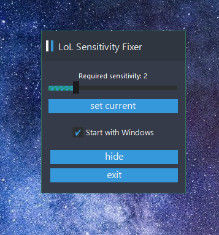

# LSF - LoL Sensitivity Fixer

League of Legends client changes user's sensitivity and does not provide Windows-friendly* sensitivity settings values.

This small application fixes the problem.

# How to use?

Set desired sensitivity via the trackbar and you're ready to go!

You can hide main window and start playing LoL.

LSF will set your sensitivity back to normal.

*(Global Windows sensitivity will be unchangeable while LoL client processes are running: `LeagueClient.exe` or `League of Legends.exe`)*

# Screenshots

# Known problems

* ~~App won't launch silencly on autorun~~ (Fixed!)